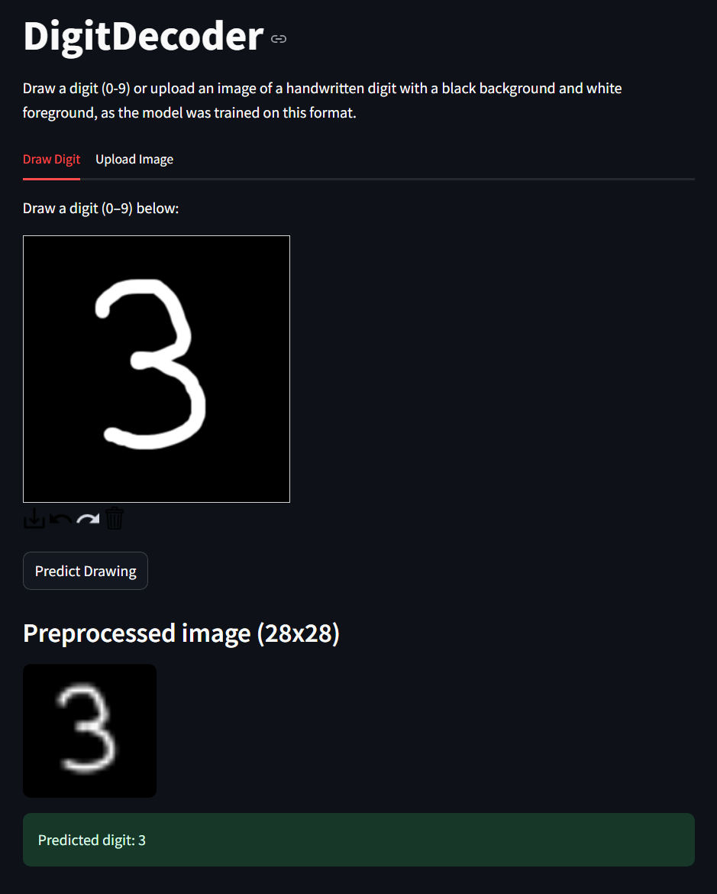
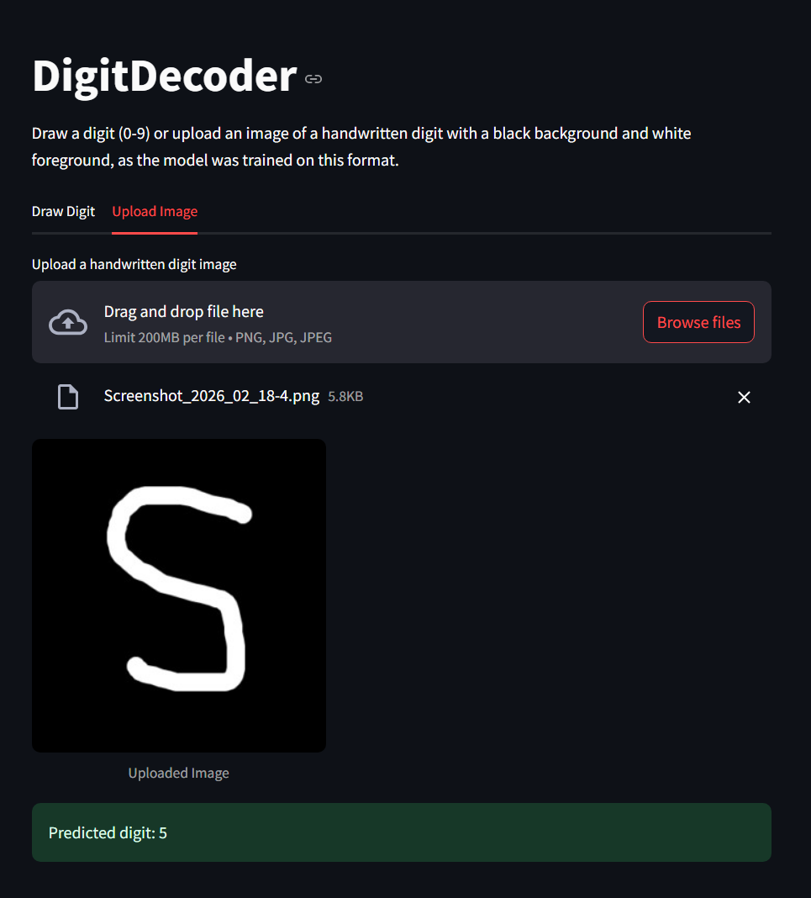

# DigitDecoder
   

**DigitDecoder** is a PyTorch-powered handwritten digit recognizer. Draw or upload images, and the CNN model predicts digits (0–9) with high accuracy via a simple Streamlit interface. Perfect for learning, AI projects, or digitization tasks.  

**Repo URL:** [https://github.com/dpm24800/DigitDecoder](https://github.com/dpm24800/DigitDecoder)  
**Notebook on Colab:** [Open in Colab](https://colab.research.google.com/drive/1w5DdIKz5Kf20lc03Xk8woqFrqIsbSiB2)  
**Deployed App:** [DigitDecoder](https://dpm24800-digitdecoder.streamlit.app/)

---

## Features

- Recognizes handwritten digits (0–9) with high accuracy.  
- Draw digits on a web-based canvas or upload images for prediction.  
- Pre-trained CNN model for fast inference.  
- Modular design: single or combined prediction features.  

---

## Files and Usage

### Model Training

- Run the notebook `digit-decoder.ipynb` **or** the script `digit-decoder.py` to train the model.  
- The model is trained on handwritten digit datasets (MNIST).  

### Prediction / Inference

- **Both features (drawing + image upload):** `app-both.py`  
- **Single feature (drawing only):** `app-drawer.py`  
- **Single feature (image upload only):** `app-uploader.py`  

Run any of the apps with:

```bash
streamlit run <filename>.py
````

---

## Screenshots & Demo

**Drawing Digits:**



**Upload Image for Prediction:**



> *Tip:* You can try the live app at [Streamlit URL](https://dpm24800-digitdecoder.streamlit.app/) to interact with the model in real-time.


---

## Installation

1. Clone the repository:

```bash
git clone https://github.com/dpm24800/DigitDecoder.git
cd DigitDecoder
```

2. Install dependencies:

```bash
pip install -r requirements.txt
```

---

## Technologies Used

* Python
* PyTorch & Torchvision
* Streamlit
* NumPy & PIL

---

## License

Distributed under the MIT License. See [LICENSE](LICENSE) for details.

## Contact

Dipak Pulami Magar – [@dpm24800](https://www.linkedin.com/in/dpm24800)  
Project Link: [https://github.com/dpm24800/DigitDecoder](https://github.com/dpm24800/DigitDecoder)
